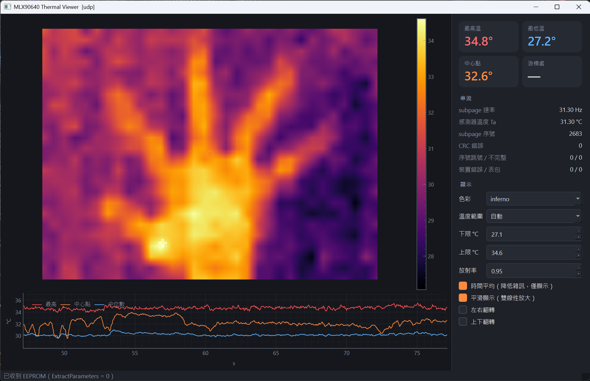
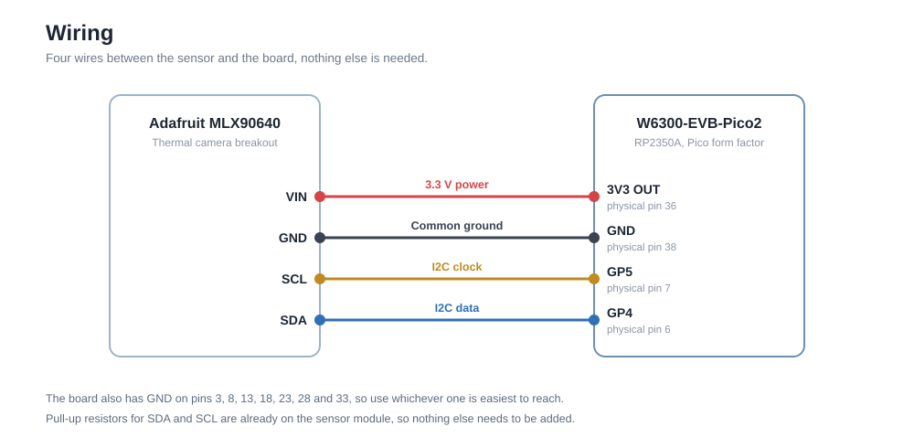
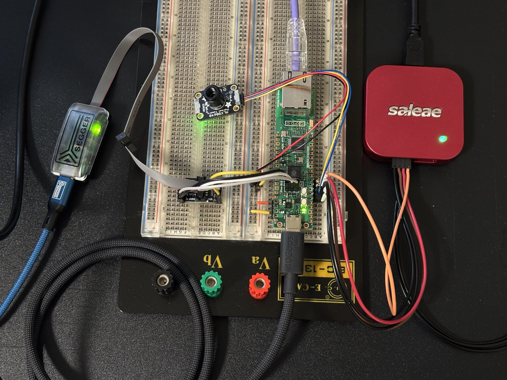

# MLX90640 Thermal Streaming on RP2350 over USB and Ethernet

這個專案用 WIZnet 的 W6300-EVB-Pico2 開發板讀取 MLX90640 熱影像感測器，把感測器吐出來的原始資料即時送到電腦，再由電腦換算成溫度並且畫成熱影像。資料可以走 USB，也可以走乙太網路，兩者使用的封包格式完全相同，所以切換的時候電腦端程式不需要做任何修改，只要多帶一個參數就好。

之所以把換算的工作放在電腦端，是因為 MLX90640 的溫度公式牽涉大量的浮點運算，交給 MCU 去做會吃掉太多時間，連帶影響讀取感測器的節奏。開發板只負責把資料原封不動地送出去，這樣韌體單純很多，電腦端也保留了完整的原始資料，日後想重新分析或換一套演算法都還來得及。

### 實際畫面



這是乙太網路模式下把手掌放在感測器前面的畫面。右側是最高溫、最低溫與中心點的溫度，以及串流速率和錯誤計數，下方是溫度隨時間的變化。

### 韌體執行架構


### 硬體架構


## 目錄

- [你需要準備的東西](#你需要準備的東西)
- [接線](#接線)
- [第一次設定](#第一次設定)
- [編譯韌體](#編譯韌體)
- [燒錄韌體](#燒錄韌體)
- [用 USB 模式看熱影像](#用-usb-模式看熱影像)
- [用乙太網路模式看熱影像](#用乙太網路模式看熱影像)
- [韌體與工具一覽](#韌體與工具一覽)
- [專案結構](#專案結構)
- [免責聲明](#免責聲明)

## 你需要準備的東西

### 硬體

* WIZnet W6300-EVB-Pico2 開發板 — **1 片**
* MLX90640 熱影像感測器模組 — **1 片**
* Micro USB 傳輸線 — **1 條**
* 網路線 — **1 條**，只有要跑乙太網路模式時才需要
* SEGGER J-Link — **1 支**，選用

開發板上的晶片是 RP2350A，雙核心 Cortex-M33，板子上另外焊了一顆 W6300 乙太網路晶片。感測器建議直接買 Adafruit 的模組，上頭已經有 I2C 的上拉電阻，省去自己外接的麻煩。

### 軟體

1. [Visual Studio Code](https://code.visualstudio.com/Download) — 寫程式、編譯與燒錄都在這裡完成。
2. [Raspberry Pi Pico 擴充功能](https://marketplace.visualstudio.com/items?itemName=raspberry-pi.raspberry-pi-pico) — 它會自動幫你把整套韌體工具鏈下載好，包含 Pico SDK、arm-none-eabi-gcc、CMake、Ninja 與 picotool，你不需要自己去找編譯器，也不用手動設定環境變數。
3. [Python 3.13](https://www.python.org/downloads/) — 電腦端的顯示程式與檢查工具都是用 Python 寫的，安裝的時候記得勾選加入 PATH，否則等一下建立虛擬環境會找不到指令。
4. [SEGGER J-Link 軟體包](https://www.segger.com/downloads/jlink/) — 選用，只有在你想讀韌體的 log 或是想用 SWD 燒錄的時候才需要安裝，平常用 USB 燒錄完全用不到它。

## 接線

感測器和開發板之間只需要四條線，電源、地線與 I2C 的兩條訊號線。



感測器一定要和開發板共地，否則 I2C 的電位沒有共同的參考點，通訊會不穩定甚至完全不通。板子上另外還有兩支腳位在開發階段會用到，GP6 在讀取感測器的期間維持高電位，GP7 每收到一個新的 subpage 就翻轉一次，這兩支腳是給示波器或邏輯分析儀量測時序用的，平常使用不必接，韌體也不會因為沒接就出問題。

> [!WARNING]
> GPIO15 到 GPIO22 已經被板載的 W6300 乙太網路晶片佔用，這是硬體上固定的接法，沒辦法改。之後要擴充其他周邊時請避開這段腳位。

## 第一次設定

### 安裝韌體工具鏈

用 VS Code 打開這個專案的資料夾，Raspberry Pi Pico 擴充功能會自己認出這是一個 Pico 專案，並且提示你安裝缺少的工具。整套東西會裝在 `%USERPROFILE%\.pico-sdk\` 底下，不會污染系統環境。這個專案用到的版本如下。

- Pico SDK 2.3.1
- arm-none-eabi-gcc 15.2.Rel1
- CMake 4.3.4
- Ninja 1.13.2
- picotool 2.3.1

> [!NOTE]
> 這些版本固定寫在 [`scripts/env.ps1`](scripts/env.ps1) 裡面，建置腳本只會用這裡指定的路徑。就算你的系統 PATH 上還裝了其他版本的 CMake 或編譯器也不會被誤用，所以不必擔心版本混淆。

### 建立電腦端的 Python 環境

在專案根目錄開啟終端機，執行下面兩行建立虛擬環境並安裝套件。

```bash
py -3.13 -m venv host/.venv
host/.venv/Scripts/python -m pip install -r host/requirements.txt
```

裝完就可以直接用了，溫度換算是用 numpy 實作的，不需要額外編譯任何東西。之後執行電腦端程式的時候，都請用 `host/.venv/Scripts/python` 這個路徑，這樣才會吃到虛擬環境裡的套件。

### 準備網路

只有要跑乙太網路模式的時候才需要做這一步，把開發板的網路孔接到你的路由器就好，不必設定任何 IP。開發板開機後會先向路由器要一個 IP，如果十五秒內要不到才會退回固定位址 192.168.1.200，而電腦端會自己在網路上找到開發板，所以中間就算換了 IP 也不影響使用。

## 編譯韌體

在 VS Code 裡直接按右下角的 **Compile** 就會開始編譯。如果你習慣用命令列，也可以執行建置腳本。

```bash
powershell -File scripts/build.ps1
```

不管用哪一種，按一次就會把所有韌體一起編出來，包含 USB 版和乙太網路版，你不需要為了換模式而重編。從空的 build 目錄開始大約需要一分鐘，之後只會重編改動到的部分，通常幾秒就好。

加上 `-Clean` 參數會先把整個 build 目錄刪掉再重建，遇到編譯結果怪怪的時候可以試試看。要燒錄的檔案都在 `build/images/`，裡面只有兩支主韌體，每支各有兩個檔案，`.elf` 是給 J-Link 用的，`.uf2` 是給 USB 燒錄用的。開發用的測試韌體另外放在 `build/images/tests/`，平常用不到。

要選哪一個韌體是燒錄時才決定的事，不是編譯時。

更新率預設是每秒 32 個 subpage，也就是每秒約 16 張完整畫面。要改的話，把 `firmware/src/main.c` 裡的 `SENSOR_RATE_32HZ` 換成 `SENSOR_RATE_16HZ` 這類的值再重新編譯，USB 版和乙太網路版會一起換。速率越低雜訊越小，可選 0.5 到 32 Hz，64 Hz 因為讀取時間不夠而無法使用。改了速率之後跑 `stream_stats.py` 要加上 `--rate 16` 這類參數，否則速率那一項檢查會判定失敗。

## 燒錄韌體

### 用 USB 燒錄

這是平常最方便的方式，不需要 J-Link，也不用手動按 BOOTSEL 按鈕。在 VS Code 裡按右下角的 **Run** 就會先編譯再燒錄，它固定燒 USB 版的 `mlx_thermal`。要燒乙太網路版就按 `Ctrl+Shift+P` 選 Tasks: Run Task，再選 Flash over USB，從兩個選項裡挑 `mlx_thermal_udp`。

命令列的做法如下，不帶參數就是燒 USB 版，帶參數則可以指定乙太網路版。

```bash
powershell -File scripts/flash_usb.ps1
powershell -File scripts/flash_usb.ps1 -Firmware mlx_thermal_udp
```

之所以連按鈕都不用按，是因為 USB 韌體裡面內建了 Raspberry Pi 的 reset 介面，picotool 可以透過它直接叫開發板自己重開進燒錄模式。

> [!NOTE]
> 不是每次都這麼順利。開發板上現在跑的如果是沒有 USB 的韌體，例如 `mlx_thermal_udp`，或者板子還沒燒過任何東西，picotool 就叫不動它，這時要按住 BOOTSEL 再插 USB 線。你不必記住這件事，遇到的時候燒錄腳本會直接告訴你該怎麼做。

### 用 J-Link 燒錄

```bash
powershell -File scripts/flash.ps1
powershell -File scripts/flash.ps1 -Elf build/images/mlx_thermal_udp.elf
```

VS Code 裡也有對應的工作，按 `Ctrl+Shift+P` 之後選 Tasks: Run Task，再選 Flash with J-Link 就可以了。

## 用 USB 模式看熱影像

先燒錄 `mlx_thermal`，這是預設的韌體。接著把 USB 線接上電腦，執行下面的指令就會跳出即時熱影像的視窗。

```bash
host/.venv/Scripts/python host/viewer.py
```

程式會依照 VID、PID 與產品名稱自動找到開發板的 COM port，所以你不需要去裝置管理員查編號，也不必在指令裡指定。如果同時插了好幾塊板子想指定其中一塊，可以寫成 `--source usb:COM9` 這種形式。

板子上 GP25 的 LED 用閃爍速度表示狀態，每秒閃一次是正常，每秒約五次代表感測器初始化失敗，通常是接線或供電的問題。想看詳細一點的數字，跑串流統計工具，它會連續接收六十秒，檢查有沒有掉包或 CRC 錯誤，最後印出 PASS 或 FAIL。

```bash
host/.venv/Scripts/python host/stream_stats.py --duration 60
```

## 用乙太網路模式看熱影像

先燒錄 `mlx_thermal_udp`，照上面燒錄那節的做法選它就好。這個版本為了省資源把 USB 功能關掉了，所以燒完之後電腦上的 COM port 會消失，這是正常的。接著把網路線接到路由器，USB 線仍然要接著，它在這個模式下只負責供電。

```bash
host/.venv/Scripts/python host/viewer.py --source udp
```

LED 在這個模式多了一種狀態，每秒約三次代表板上的網路晶片沒有回應，這時韌體還在讀感測器，只是資料送不出去。要注意網路線沒插的時候燈號不會變，仍然是每秒一次，但電腦端會一直找不到開發板，所以畫面沒出來時先檢查網路線。

顯示程式和 USB 模式用的是同一支，差別只在資料從哪裡來。它尋找開發板的方式是這樣的，先試上一次記住的位址，那個位址存在 `host/.board_address` 這個檔案裡，如果沒有得到回應才改用廣播搜尋，找到之後就固定用單播通訊，並且把新的位址記起來給下次用。你如果想跳過搜尋直接指定位址，用 `--source udp:192.168.1.50` 這種寫法就可以。

> [!NOTE]
> 之所以要這樣繞一圈，是因為 Wi-Fi 的廣播封包不會重傳，比一般的單播封包更容易丟失。把廣播限制在一開始的搜尋階段，串流本身就完全不受這個問題影響。

## 韌體與工具一覽

### 韌體

| 韌體 | 用途 |
|---|---|
| `mlx_thermal` | 主韌體，走 USB 串流，單核心 |
| `mlx_thermal_udp` | 主韌體，走乙太網路串流，網路跑在核心 1 |

`build/images/tests/` 底下另外還有幾支測試韌體，那些是開發階段用來驗證硬體的，用法寫在 [docs/debugging.md](docs/debugging.md)。

### 電腦端工具

| 工具 | 用途 |
|---|---|
| `host/viewer.py` | 即時熱影像介面 |
| `host/stream_stats.py` | 串流品質檢查，最後印出 PASS 或 FAIL |

資料來源一律用 `--source` 指定，可以寫 `usb` 或 `udp`，也可以寫得更明確一點，像是 `usb:COM9` 或 `udp:192.168.1.50`。`viewer.py` 另外支援 `--replay 檔案`，可以離線播放先前錄下來的串流，在開發顯示功能的時候就不必一直接著開發板，要錄製串流則是在 `stream_stats.py` 加上 `--save 檔案`。

溫度換算預設使用 numpy 實作，不需要任何額外設定。如果你想改用 Melexis 官方的 C 程式來交叉比對，先執行 `scripts/build_host_lib.ps1` 編出 DLL，再加上 `--calc melexis` 參數。兩者的差異小於 0.04 mK，比感測器本身的雜訊小了大約一萬倍，驗證的過程記錄在 [docs/method_b_compare.md](docs/method_b_compare.md)。

## 專案結構

```
CMakeLists.txt     頂層建置檔，也是 VS Code 擴充功能的進入點
firmware/          韌體原始碼
  src/             主程式、感測器、I2C、協定、傳輸層、網路
  tests/           各項測試韌體
host/              電腦端 Python
  mlxstream/       協定解析、資料來源、溫度換算
  native/          Melexis C 程式的包裝層，選用
  tools/           開發階段的量測資料分析腳本
scripts/           建置、燒錄、RTT 的 PowerShell 腳本
docs/              協定規格、各階段的量測紀錄、架構圖
third_party/       SEGGER RTT、Melexis 函式庫、WIZnet 驅動，都保持原樣未修改
build/             建置輸出，不進 git，要燒錄的檔案在 build/images/
captures/ logs/    量測資料與 log，不進 git
```

延伸閱讀：

- [docs/protocol.md](docs/protocol.md) 串流協定規格，USB 與乙太網路共用
- [docs/dual_core.md](docs/dual_core.md) 雙核心分工的設計與實測結果
- [docs/dhcp_discovery.md](docs/dhcp_discovery.md) DHCP 與自動搜尋開發板的做法
- [docs/debugging.md](docs/debugging.md) 讀 log、追查當機、測試韌體與硬體驗證
- [CLAUDE.md](CLAUDE.md) 專案規格、里程碑與已知問題

## 免責聲明

此專案大部分由 Anthropic 的 Claude 完成。我負責所有的硬體準備工作、Claude 無法完成的部分以及需要人為介入決策的部分。Claude 使用桌面版 Claude Code 在我的電腦上執行工作，撰寫韌體與電腦端的軟體，並且透過 CLI 直接操作 JLink 燒錄韌體與讀取 RTT log，同時也透過 Logic 2 的 MCP 介面控制 Logic 8 邏輯分析儀擷取 I2C 波形，再自己寫軟體分析量測結果。



照片由左到右是 SEGGER J-Link EDU 與 SWD 轉接板、Adafruit MLX90640 模組、連接紫色網路線的 W6300-EVB-Pico2，以及 Saleae Logic 8。