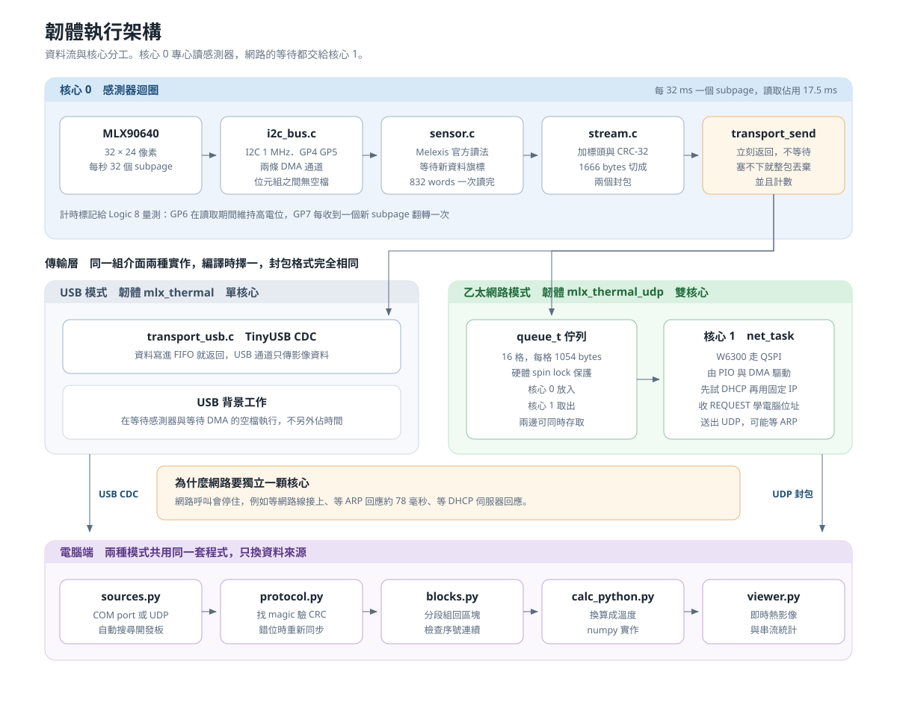
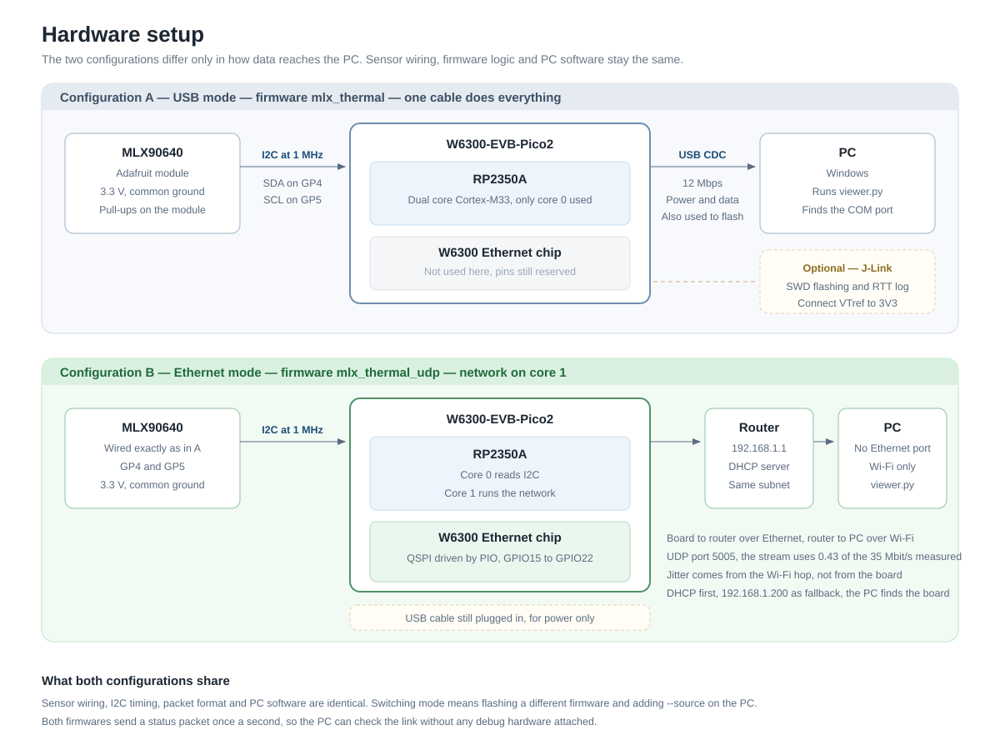

# MLX90640 熱影像串流（W6300-EVB-Pico2）

用 RP2350 以 1 MHz I2C 讀取 MLX90640 熱影像感測器，把**原始資料**串流到電腦，電腦端換算溫度並即時顯示。傳輸層可選 **USB CDC** 或 **乙太網路 UDP**，兩者使用完全相同的封包格式。

- 影像：32×24，每秒 **31.3 個 subpage**（約 15.6 張完整畫面）
- 電腦端顯示：即時熱影像、溫度曲線、串流統計
- 實測：連續 300 秒 0 掉包、0 CRC 錯誤

### 韌體執行架構



### 硬體架構（兩種組態）



---

## 目錄

- [硬體與接線](#硬體與接線)
- [第一次設定](#第一次設定)
- [編譯](#編譯)
- [燒錄](#燒錄)
- [執行：USB 模式](#執行usb-模式)
- [執行：乙太網路模式](#執行乙太網路模式)
- [除錯](#除錯)
- [韌體一覽](#韌體一覽)
- [電腦端工具一覽](#電腦端工具一覽)
- [專案結構](#專案結構)

---

## 硬體與接線

| 項目 | 規格 |
|---|---|
| 開發板 | WIZnet W6300-EVB-Pico2（RP2350A，雙核心 Cortex-M33） |
| 感測器 | MLX90640（SparkFun 模組，I2C，1 MHz） |
| 乙太網路 | 板載 W6300（GPIO15～22，不可他用） |
| 除錯器（選用） | SEGGER J-Link EDU，SWD |
| 邏輯分析儀（選用） | Saleae Logic 8 |

**接線**

| 訊號 | 腳位 | 接到 | Logic 8 |
|---|---|---|---|
| I2C0 SDA | GP4 | MLX90640 SDA | CH0 |
| I2C0 SCL | GP5 | MLX90640 SCL | CH1 |
| 計時標記 A | GP6 | —（量測用） | CH2 |
| 計時標記 B | GP7 | —（量測用） | CH3 |
| LED | GP25 | 板載 | — |

感測器供電 3.3V，與開發板共地。J-Link 的 VTref 要接 3V3，否則偵測不到目標電壓。

---

## 第一次設定

### 1. 韌體工具鏈

用 VS Code 的 **Raspberry Pi Pico** 擴充功能安裝（會裝到 `%USERPROFILE%\.pico-sdk\`）：

- Pico SDK **2.3.1**
- arm-none-eabi-gcc **15.2.Rel1**
- CMake **4.3.4**、Ninja **1.13.2**、picotool **2.3.1**

版本固定在 [`scripts/env.ps1`](scripts/env.ps1)。系統 PATH 上如果有其他版本（例如 MSYS2）不會被使用。

### 2. 電腦端 Python 環境

```bash
py -3.13 -m venv host/.venv
host/.venv/Scripts/python -m pip install -r host/requirements.txt
```

之後所有指令都用 `host/.venv/Scripts/python`。

### 3. 溫度換算用的 DLL

電腦端用 Melexis 官方 C 程式換算溫度，需要編一次：

```bash
powershell -File scripts/build_host_lib.ps1
```

需要 MSYS2 的 64 位元 gcc（`C:\msys64\mingw64\bin\gcc.exe`）。
如果不想裝編譯器，可以改用純 Python 版本（加 `--calc python`，結果與官方版本差異小於 0.04 mK，見 [docs/method_b_compare.md](docs/method_b_compare.md)）。

### 4. 乙太網路（只有用網路模式時需要）

把開發板的網路孔接到路由器。開發板會先試 DHCP，失敗才用固定 IP `192.168.1.200`。電腦端會自動找到它，不需要設定。

---

## 編譯

**VS Code：** 直接按右下角的 **Compile**。

**命令列：**

```bash
powershell -File scripts/build.ps1
```

加 `-Clean` 會刪掉 build 目錄重建。輸出在 `build/firmware/`，每個韌體都會產生 `.elf`（J-Link 用）和 `.uf2`（USB 用）。

---

## 燒錄

### 方法 A：USB（不需要 J-Link）

**VS Code：** 按右下角的 **Run**（會先編譯再燒錄）。

**命令列：**

```bash
powershell -File scripts/flash_usb.ps1                        # 主韌體（USB 模式）
powershell -File scripts/flash_usb.ps1 -Firmware pin_test     # 指定韌體
```

USB 韌體內含 Raspberry Pi 的 reset 介面，`picotool` 會自己把板子重開進燒錄模式，**不用按 BOOTSEL**。

**什麼時候還是要按 BOOTSEL：** 板子目前跑的是 `mlx_thermal_udp`（那版沒有 USB），或板子還沒有韌體。做法是按住 BOOTSEL 再插 USB，然後重跑上面的指令。

### 方法 B：J-Link（SWD）

```bash
powershell -File scripts/flash.ps1                                      # 主韌體
powershell -File scripts/flash.ps1 -Elf build/firmware/net_test.elf     # 指定韌體
```

VS Code 也有對應的工作：`Ctrl+Shift+P` → Tasks: Run Task → **Flash with J-Link (choose firmware)**。

---

## 執行：USB 模式

1. 燒錄 `mlx_thermal`（預設），USB 線接電腦
2. 開啟顯示程式：

```bash
host/.venv/Scripts/python host/viewer.py
```

程式會自動找到 COM port（依 VID/PID 與產品名稱）。

**驗證串流品質：**

```bash
host/.venv/Scripts/python host/stream_stats.py --source usb --duration 60
```

會檢查 CRC 錯誤、序號跳號、幀率、裝置端錯誤計數，最後印出 PASS／FAIL。

---

## 執行：乙太網路模式

1. 燒錄 `mlx_thermal_udp`（需要 BOOTSEL 或 J-Link，因為這版沒有 USB）
2. 網路線接路由器，USB 仍需接著供電
3. 開啟顯示程式：

```bash
host/.venv/Scripts/python host/viewer.py --source udp
```

**電腦怎麼找到板子：** 先試上次記住的位址（`host/.board_address`），沒有回應才用廣播搜尋，找到後全程單播並記住位址。所以板子的 IP 換了也不用重設。要指定位址時用 `--source udp:192.168.1.50`。

**顯示程式完全相同**，只是換了資料來源。

---

## 除錯

### 韌體的 log：目前只有 RTT，需要 J-Link

韌體的所有 log 都走 **SEGGER RTT**（透過 SWD 讀取 RAM），不佔用 UART 腳位、也不影響 I2C 時序。規格明確規定 USB 只傳影像資料，不傳 log。

```bash
powershell -File scripts/rtt.ps1                                    # 開始記錄主韌體
powershell -File scripts/rtt.ps1 -Elf build/firmware/net_test.elf   # 指定韌體
powershell -File scripts/rtt.ps1 -Stop                              # 停止
```

log 會寫到 `logs/`，VS Code 工作 **RTT log** 也可以啟動。

> **注意：** RTT 緩衝區有 8 KB，logger 附著時會先讀到**上一次執行留下的舊內容**，所以 log 開頭常看起來像「多開機了一次」。分析時要注意。

### 沒有 J-Link 的話能看到什麼？

看不到韌體的 log，但仍然有三個管道：

| 管道 | 內容 |
|---|---|
| **STATUS 封包**（每秒一次） | 讀取錯誤、subpage 順序錯誤、等待逾時、傳輸丟包、最長讀取時間 |
| **電腦端統計** | `stream_stats.py` 會印出上述計數與 CRC、跳號、幀率 |
| **LED（GP25）** | 每秒閃一次代表主迴圈正常；快速閃爍代表感測器初始化失敗 |

這些足以判斷「有沒有在正常運作」，但看不到啟動過程和錯誤訊息的細節。要追問題時還是需要 J-Link。

### 用 J-Link 檢查當機位置

```bash
# 停住 CPU 讀暫存器（core 1 用 RP2350_M33_1）
"C:\Program Files\SEGGER\JLink\JLink.exe" -NoGui 1 -device RP2350_M33_0 -if SWD -speed 4000 -autoconnect 1
# J-Link> halt / regs / mem32 <SP> 0x40
```

把 PC 或 LR 的位址對應回原始碼：

```bash
~/.pico-sdk/toolchain/15_2_Rel1/bin/arm-none-eabi-addr2line.exe -f -e build/firmware/mlx_thermal_udp.elf 0x10000E94
```

> **接偵錯器時的注意事項：** J-Link 的 reset 只重置核心 0。用到核心 1 的韌體必須先呼叫 `multicore_reset_core1()`，否則核心 1 會繼續跑舊程式導致開機卡住（已在 `transport_udp.c` 處理）。

### 時序量測（Logic 8）

GP6／GP7 是計時標記，配合 `host/tools/` 的分析腳本可以量 I2C 波形、subpage 讀取時間、上升時間等。詳見 [docs/m3_timing.md](docs/m3_timing.md)。

---

## 韌體一覽

| 韌體 | 用途 |
|---|---|
| **`mlx_thermal`** | 主韌體，USB CDC 串流（單核心） |
| **`mlx_thermal_udp`** | 主韌體，乙太網路 UDP 串流（核心 1 跑網路） |
| `mlx_thermal_16hz` / `mlx_thermal_64hz` | 同上，不同更新率，用於時序比較 |
| `net_test` | 乙太網路 bring-up：ping 與 UDP 吞吐量測試 |
| `pin_test` | 檢查 Logic 8 四個通道的接線 |
| `rise_test` | 量測 I2C 線路上升時間 |
| `eeprom_test_400k` / `eeprom_test_1000k` | 以指定速率讀 EEPROM 並驗證 |
| `eeprom_soak_1000k` | 1 MHz 連續讀取的長時間測試 |

---

## 電腦端工具一覽

| 工具 | 用途 |
|---|---|
| `host/viewer.py` | 即時熱影像 GUI（pyqtgraph） |
| `host/stream_stats.py` | 串流品質檢查，印出 PASS／FAIL |
| `host/check_temps.py` | 溫度合理性檢查 |
| `host/net_test.py` | 搭配 `net_test` 韌體的 UDP 吞吐量測試 |
| `host/tests/test_protocol.py` | 封包解析器的單元測試（不需硬體） |
| `host/tools/*.py` | Logic 8 擷取資料的分析腳本 |

共通參數：

- `--source usb` / `--source udp` / `--source udp:<ip>` / `--source usb:COM9`
- `--calc melexis`（預設，官方 C 程式）或 `--calc python`（numpy 版本）
- `viewer.py --replay <檔案>`：離線播放錄下的串流，不需要板子
- `stream_stats.py --save <檔案>`：錄下原始串流供日後重播

---

## 專案結構

```
CMakeLists.txt     頂層建置檔（VS Code 擴充功能的進入點）
firmware/          韌體原始碼
  src/             主程式、感測器、I2C、協定、傳輸層、網路
  tests/           各項測試韌體
host/              電腦端 Python
  mlxstream/       協定解析、資料來源、溫度換算
  native/          Melexis C 程式的包裝層（編成 DLL）
  tools/           Logic 8 資料分析
scripts/           建置、燒錄、RTT 的 PowerShell 腳本
docs/              協定規格、各階段量測紀錄、架構圖
third_party/       SEGGER RTT、Melexis 函式庫、WIZnet 驅動（原樣保留）
build/             建置輸出（不進 git）
captures/ logs/    量測資料與 log（不進 git）
```

主要文件：

- [docs/protocol.md](docs/protocol.md) — 串流協定規格（USB 與 UDP 共用）
- [docs/dual_core.md](docs/dual_core.md) — 雙核心分工
- [docs/dhcp_discovery.md](docs/dhcp_discovery.md) — DHCP 與自動搜尋
- [CLAUDE.md](CLAUDE.md) — 專案規格、里程碑、已知問題
